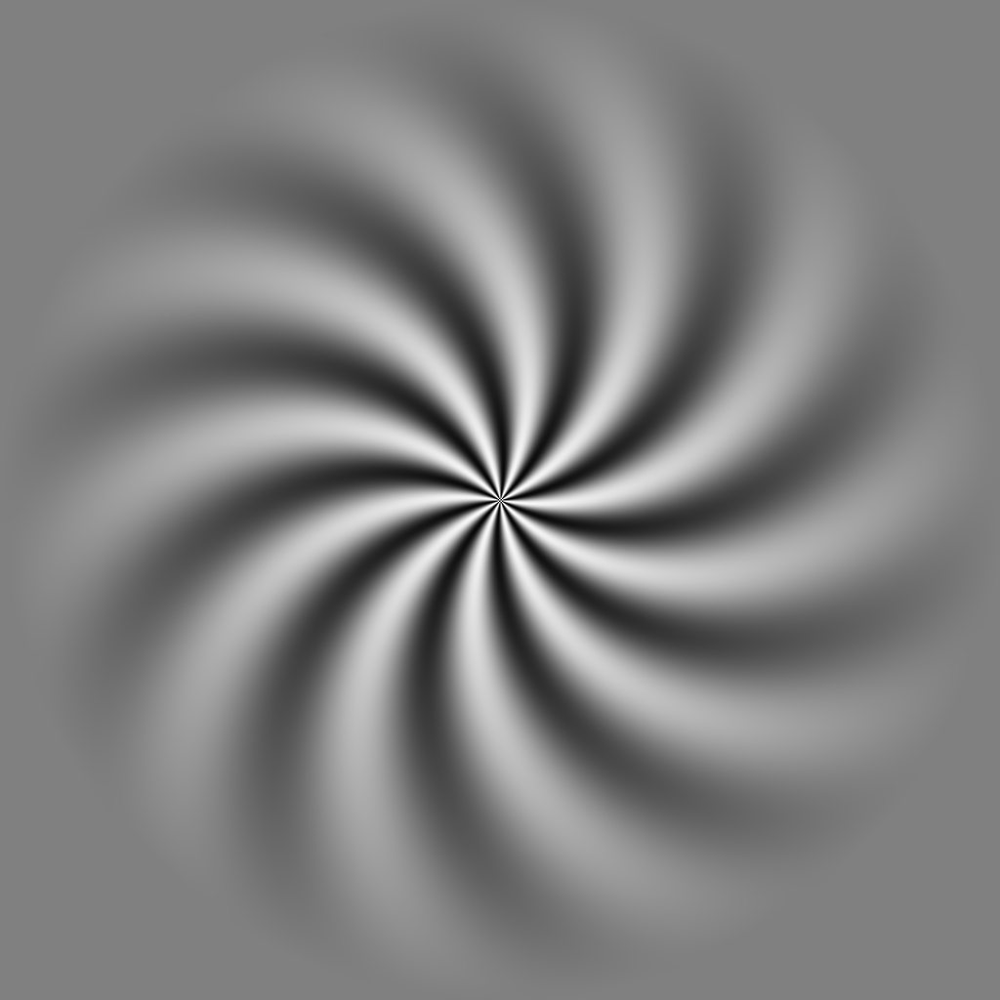
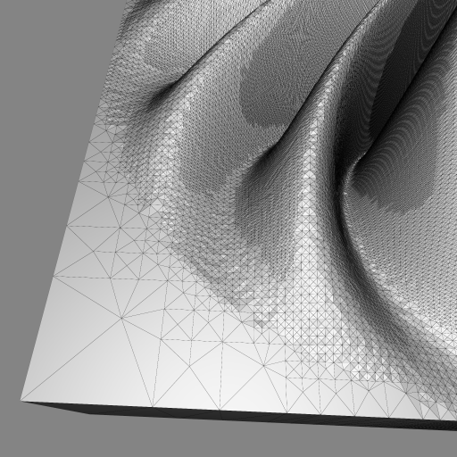
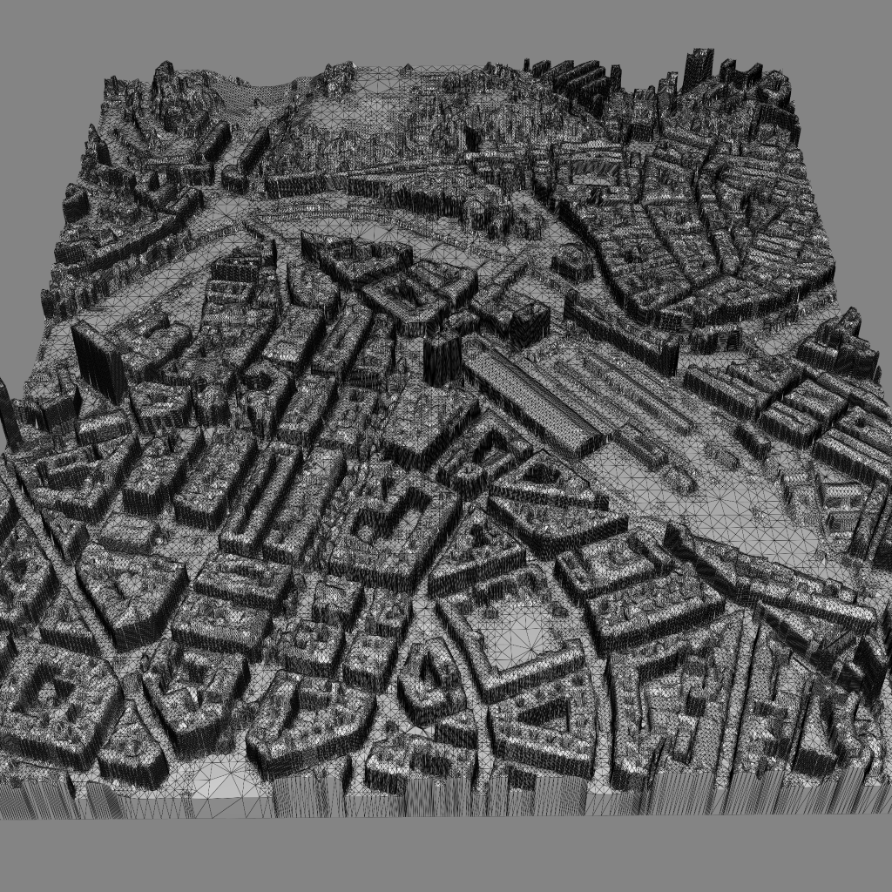

# Heightmap 2 STL

This is a Python script to convert heightmaps of terrain or cities into STL files. The resulting STL file can be used for 3D printing or further processing in CAD software.
To reduce the required vertices dynamic subdivision is used instead of an equidistant vertex grid.

## Usage

The input file is a grayscale image, the output file is the resulting STL file.

The script can be run from the command line. The following options are available:

```js
Usage: python height2stl.py <input_file> [options]
Options:
  -n <nx = 1> <ny = 1>: the number of terrain meshes to create in the x and y directions.
  -s <max_subdivisions = 10>: the maximum number of times to subdivide the plane.
  -t <threshold = 0.01>: the minimum detail value to subdivide the plane at.
  -z <z_scale = 1>: the height of the terrain.
  -g <ground_height = 0>: the base elevation of the ground.
  -o <output_file>: the output file to write to. If not specified, the input file name will be used.
  -h: print this help message.
```

> **It is recommend to use a high-dynamic range image format (e.g. .exr) for the heightmap to avoid staircasing artifacts.**

#

### Examples

Input Heightmap            |  Resulting Mesh
:-------------------------:|:-------------------------:
    |  
         |  
