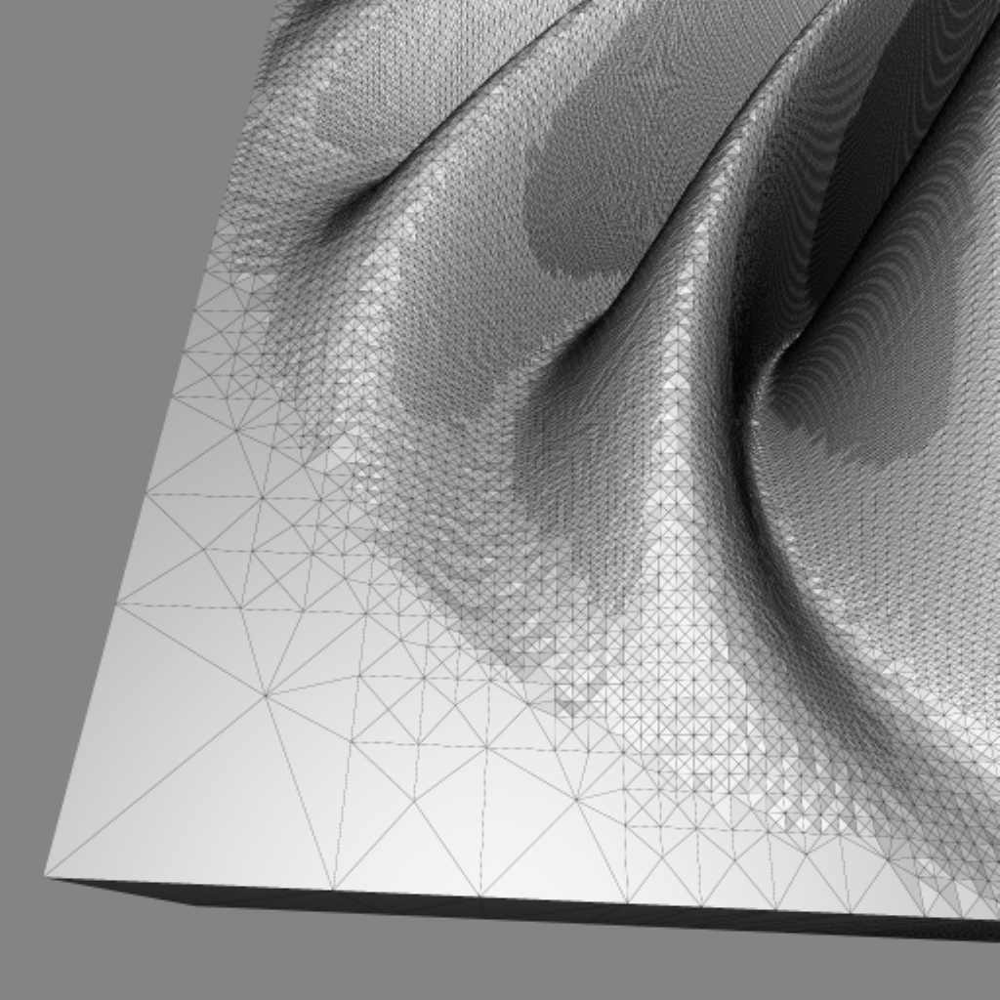

# Heightmap2STL

This repository aims to convert heightmaps into STL files for 3D printing or Finite Element Method Simulations. To reduce the required vertices dynamic subdivision is used instead of an equidistant vertex grid.

## Usage

The script can be used as follows:

```bash
python heightmap2stl.py -i <inputfile> -o <outputfile> -s <scale> -d <divisions>
```

The input file is a grayscale image, the output file is the resulting STL file. The scale parameter is used to scale the heightmap to the desired size. The divisions parameter is used to control the number of subdivisions. The number of vertices is 2^divisions + 1.

## Example


Here is an example of a heightmap and the resulting STL file:


